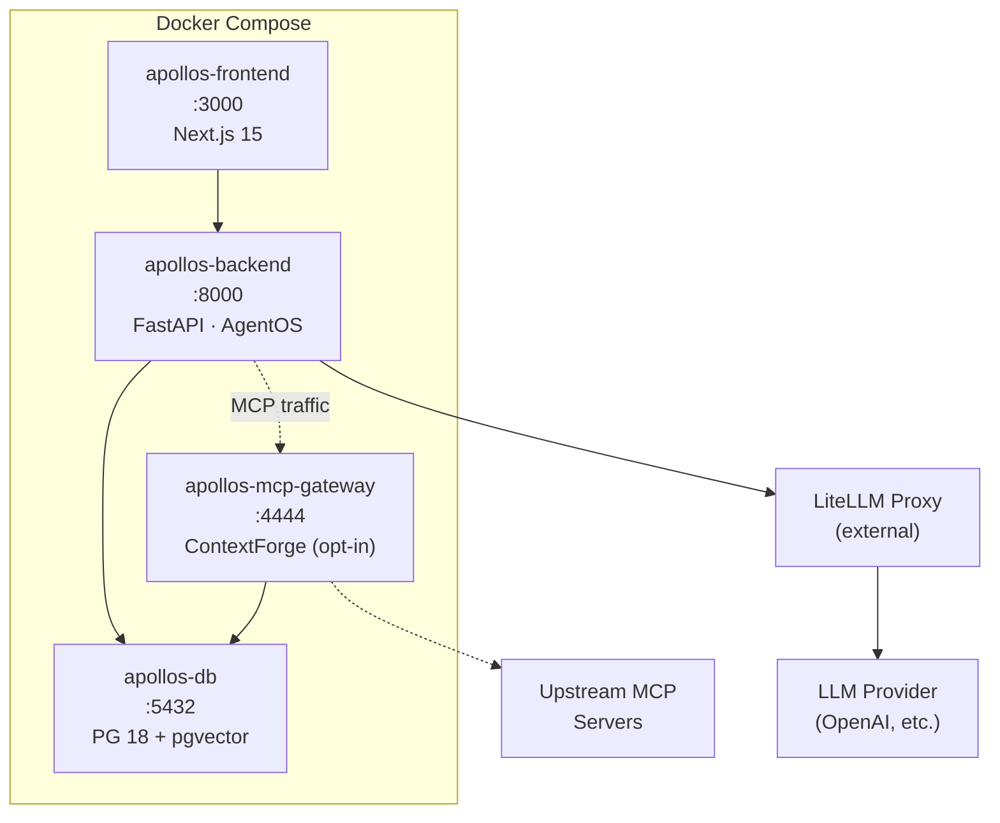

## System overview



## Components

### Backend (`apollos-backend`)

FastAPI application using Agno's `AgentOS` as the runtime. Registers agents, teams, and workflows, handles API requests, manages sessions, and routes LLM traffic through LiteLLM Proxy.

| Directory | Purpose |
|-----------|---------|
| `backend/main.py` | Entry point. Creates AgentOS, registers agents/teams/workflows |
| `backend/models.py` | Shared model factory (`get_model()`) for all agents |
| `backend/config.yaml` | Quick-prompt configuration for the UI |
| `backend/agents/` | Agent modules (each exports an `Agent` instance) |
| `backend/mcp/` | MCP Gateway integration (ContextForge client, tools factories, proxy routes) |
| `backend/teams/` | Multi-agent team definitions |
| `backend/workflows/` | Multi-step workflow pipelines |
| `backend/tools/` | Custom tools (search, awareness, approval-gated ops, introspect, save_query, save_discovery) |
| `backend/context/` | Agent context providers (semantic model, business rules, intent routing, source registry) |
| `backend/knowledge/` | Document loaders, source metadata (`sources/`), search patterns (`patterns/`) |
| `backend/scripts/` | Data loading scripts (sample data, knowledge base) |
| `backend/db/` | Database layer (connection factory, URL builder, knowledge factory) |
| `backend/evals/` | Evaluation harness (LLM grading, golden SQL comparison, source citation checking, Rich CLI) |
| `backend/telemetry.py` | OpenTelemetry trace export configuration |

### Frontend (`apollos-frontend`)

Next.js 15 (App Router) with standalone output. Connects to the backend via browser-side fetch (not server-side rendering). State managed by Zustand.

| File | Purpose |
|------|---------|
| `frontend/src/store.ts` | Zustand state: endpoint URL, auth token, agent selection |
| `frontend/src/api/` | Browser-side API client for AgentOS |
| `frontend/src/hooks/` | React hooks (AI streaming, chat actions, session loader) |
| `frontend/src/components/` | React components (shadcn/ui based) |

### Database (`apollos-db`)

PostgreSQL 18 with the pgvector extension. Stores:

- Agent session data and conversation history
- Vector embeddings for RAG knowledge bases
- Learned knowledge from LearningMachine
- User profiles and per-user memory
- Team and workflow state

### LLM proxy (external)

A [LiteLLM Proxy](https://docs.litellm.ai/docs/) instance that you host separately. All model and embedding requests from the backend route through it, providing a single point of control for API keys, rate limits, and provider switching.

## Data flow

1. User sends a message through the frontend UI
2. Frontend makes a browser-side fetch to `apollos-backend` at the configured endpoint
3. Backend receives the request via FastAPI, routes to the selected agent (or team/workflow)
4. Agent processes the request: searches knowledge base (pgvector), calls tools, checks guardrails, generates a response via LiteLLM Proxy
5. Response streams back to the frontend
6. Session data, learnings, and user context are persisted to PostgreSQL

## Project structure

```
apollos-ai/
├── backend/                 # Python backend
│   ├── main.py              # Entry point, agent/team/workflow registration
│   ├── models.py            # Shared model factory (get_model)
│   ├── config.yaml          # UI quick-prompts
│   ├── telemetry.py         # OpenTelemetry export
│   ├── agents/              # Agent modules
│   │   ├── knowledge_agent.py
│   │   ├── mcp_agent.py
│   │   ├── web_search_agent.py
│   │   ├── reasoning_agent.py
│   │   └── data_agent.py
│   ├── mcp/                 # MCP Gateway integration
│   │   ├── config.py        # Feature flag, gateway client factory
│   │   ├── gateway_client.py # ContextForge API client
│   │   ├── tools_factory.py # Gateway-aware MCPTools factories
│   │   ├── routes.py        # Proxy routes (/mcp/servers)
│   │   ├── schemas.py       # Pydantic models
│   │   └── validation.py    # BYOMCP URL validation
│   ├── teams/               # Multi-agent teams
│   │   └── research_team.py
│   ├── workflows/           # Multi-step workflows
│   │   └── research_workflow.py
│   ├── tools/               # Custom tools
│   │   ├── search.py
│   │   ├── awareness.py
│   │   ├── approved_ops.py
│   │   ├── introspect.py
│   │   ├── save_query.py
│   │   └── save_discovery.py
│   ├── context/             # Agent context providers
│   │   ├── semantic_model.py
│   │   ├── business_rules.py
│   │   ├── intent_routing.py
│   │   └── source_registry.py
│   ├── knowledge/           # Document loaders and knowledge assets
│   │   ├── loaders.py
│   │   ├── sources/         # Structured source metadata JSON
│   │   └── patterns/        # Common search strategy patterns
│   ├── scripts/             # Data loading scripts
│   │   ├── load_sample_data.py
│   │   └── load_knowledge.py
│   ├── evals/               # Evaluation harness
│   │   ├── test_cases.py
│   │   ├── grader.py
│   │   └── run_evals.py
│   ├── db/                  # Database layer
│   │   ├── session.py       # PostgresDb + Knowledge factories
│   │   └── url.py           # DB URL builder
│   ├── Dockerfile
│   └── Dockerfile.dockerignore
├── frontend/                # Next.js frontend
│   ├── src/
│   │   ├── app/             # App Router pages
│   │   ├── components/      # React components
│   │   ├── hooks/           # React hooks (streaming, chat, sessions)
│   │   ├── api/             # API client
│   │   └── store.ts         # Zustand state
│   ├── Dockerfile
│   └── .dockerignore
├── docs/                    # Mintlify documentation site
│   ├── docs.json            # Mintlify config
│   ├── Dockerfile
│   └── *.mdx               # Documentation pages
├── data/
│   ├── docs/                # Knowledge base source docs (PDF, CSV)
│   ├── tables/              # F1 table metadata JSON files
│   ├── queries/             # Validated SQL query patterns
│   └── business/            # Business rules and metrics definitions
├── tests/                   # Integration tests
├── mise-tasks/              # Dev workflow tasks
├── scripts/                 # Container-only scripts
│   └── entrypoint.sh
├── docker-compose.yaml      # Dev compose
├── docker-compose.prod.yaml # Prod compose
├── pyproject.toml           # Python project config
├── mise.toml                # Mise config
└── example.env              # Environment template
```

## Key dependencies

### Backend

| Package | Purpose |
|---------|---------|
| `agno` | Agent framework (Agent, AgentOS, Team, Workflow, Knowledge, tools) |
| `fastapi[standard]` | HTTP API with uvicorn |
| `openai` | OpenAI client (used by Agno embedders and LiteLLM) |
| `pgvector` | Vector similarity search for PostgreSQL |
| `psycopg[binary]` | PostgreSQL adapter |
| `sqlalchemy` | ORM / database toolkit |
| `mcp` | Model Context Protocol client |
| `litellm` | Multi-provider LLM routing (external proxy, no [proxy] extra) |
| `ddgs` | Web search backend for WebSearchTools |
| `fastmcp` | MCP server for AgentOS (`enable_mcp_server`) |
| `pypdf` | PDF document loading for knowledge base |
| `pandas` | Data loading and CSV processing for sample data |
| `httpx` | HTTP client for downloading sample datasets |
| `rich` | Rich CLI output for the evaluation runner |
| `opentelemetry-*` | OTel trace export (opt-in) |
| `openinference-instrumentation-agno` | Agno-specific OTel instrumentation |

### Frontend

| Package | Purpose |
|---------|---------|
| `next` (15) | React framework (App Router) |
| `react` (18) | UI library |
| `tailwindcss` | Utility-first CSS |
| `zustand` | State management |
| `@radix-ui/*` | Accessible UI primitives (shadcn/ui) |
