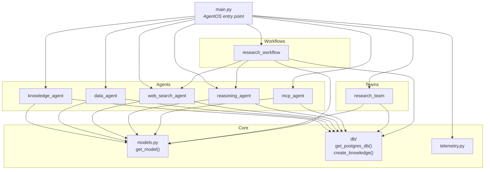
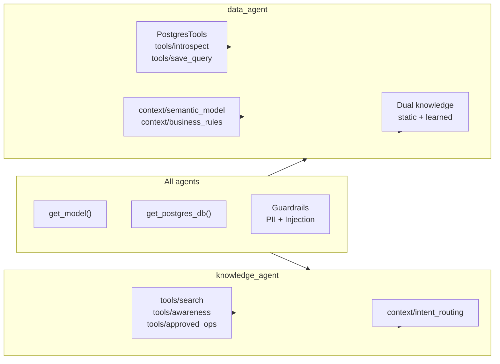
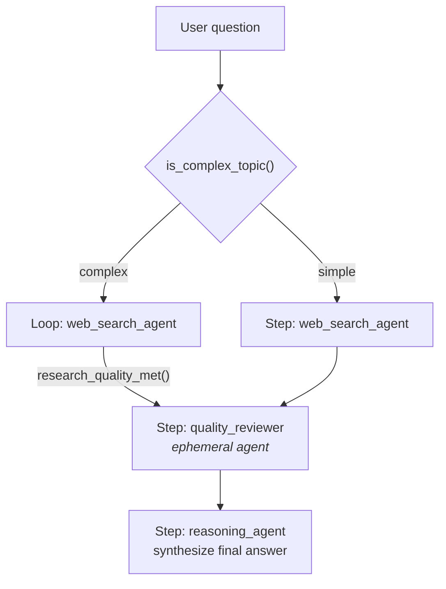
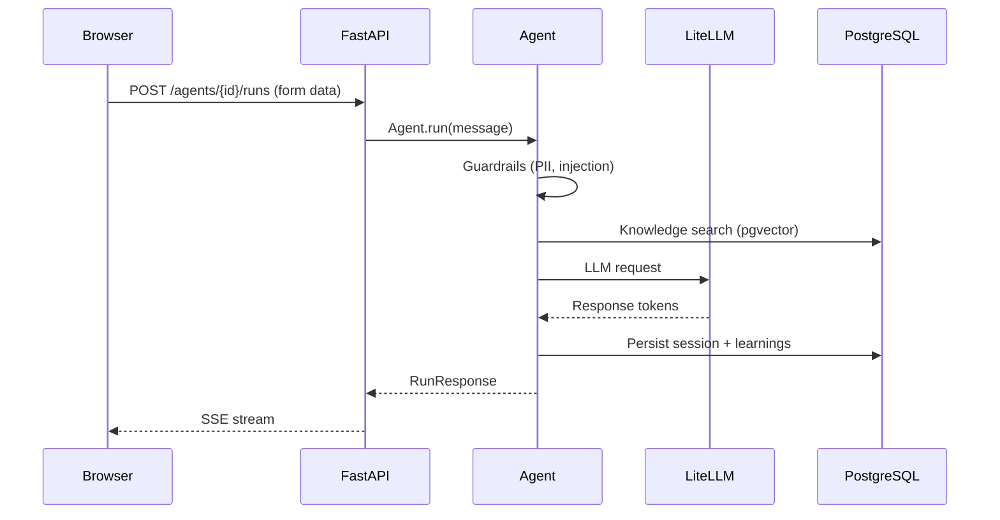
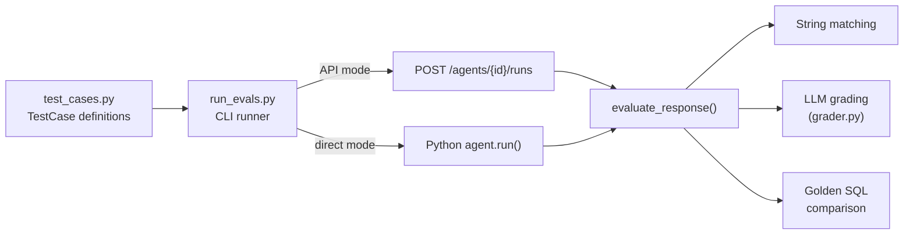

Visual guide to how backend modules connect, how data flows through the system, and where each concern lives.

For the high-level system diagram and component descriptions, see [Architecture](/reference/architecture).

## Backend dependency graph



## Agent wiring

Each agent uses the same core pattern with agent-specific tools and context layers.



| Agent | Tools | Context | Knowledge |
|-------|-------|---------|-----------|
| `knowledge_agent` | search, awareness, approved_ops | intent_routing | Single knowledge base (PDF/CSV) |
| `data_agent` | PostgresTools, introspect, save_query | semantic_model, business_rules | Dual: static `data_knowledge` + dynamic `data_learnings` |
| `web_search_agent` | WebSearchTools (DuckDuckGo) | None | None |
| `reasoning_agent` | ReasoningTools | None | None |
| `mcp_agent` | MCPTools | None | None |

## Tool patterns

Tools use two injection patterns depending on whether they need runtime state.

### Lazy injection

Tools that reference a shared knowledge base receive it at import time via a setter.

```python
# backend/tools/search.py
_knowledge = None

def set_knowledge(k):
    global _knowledge
    _knowledge = k

@tool
def search_content(query: str) -> str:
    return _knowledge.search(query)
```

```python
# backend/agents/knowledge_agent.py
from backend.tools.search import search_content, set_knowledge
set_knowledge(knowledge)  # bind at agent init
```

### Factory functions

Tools that need a database URL or knowledge instance return a closure with dependencies pre-bound.

```python
# backend/tools/introspect.py
def create_introspect_schema_tool(db_url: str):
    @tool
    def introspect_schema(table: str) -> str:
        engine = create_engine(db_url)
        # ... inspect table
    return introspect_schema
```

## Research workflow pipeline

The research workflow chains agents through a `Step > Loop > Condition` pipeline.



| Primitive | Role | Callback |
|-----------|------|----------|
| `Condition` | Route complex vs. simple topics | `is_complex_topic(step_input) -> bool` |
| `Loop` | Iterate web search until quality met | `research_quality_met(step_outputs) -> bool` |
| `Step` | Single agent execution | None |

## Context module structure

Static context injected into agent instructions as formatted strings.

| Module | Output | Source | Used by |
|--------|--------|--------|---------|
| `semantic_model.py` | Markdown table schema | Inline Python dict | data_agent |
| `business_rules.py` | Formatted metrics and rules | `data/business/*.json` | data_agent |
| `intent_routing.py` | Search strategy table | Inline Python string | knowledge_agent |

## Frontend component tree

```
app/
├── layout.tsx               # Root layout, fonts, providers
└── page.tsx                 # Home (chat interface)

components/
├── chat/
│   ├── Sidebar/             # Sessions, entity selector, mode selector
│   └── ChatArea/            # Messages, input, streaming state
└── ui/                      # shadcn/ui primitives + custom components

hooks/
├── useAIResponseStream      # SSE stream parsing
├── useAIStreamHandler       # Message assembly from events
├── useChatActions           # Send, delete, new chat
└── useSessionLoader         # Load and list sessions

api/
├── os.ts                    # AgentOS HTTP client
└── routes.ts                # Endpoint URL builders

store.ts                     # Global state (API URL, selected entity, auth)
```

## Request lifecycle



<Note>
Run endpoints accept **form data** (`Content-Type: multipart/form-data`), not JSON. The only required field is `message`. Set `stream=false` for a single JSON response instead of SSE.
</Note>

## Evaluation harness



| Mode | Flag | Requires backend |
|------|------|-----------------|
| String matching | (default) | Yes (API) or No (direct) |
| LLM grading | `-g` | Yes (API) or No (direct) |
| Golden SQL | `-r` | Yes (API + database) |
| Direct invocation | `--direct` | No |

## Data directory layout

```
data/
├── docs/         # PDF and CSV files for knowledge agent
├── tables/       # F1 table metadata JSON (data agent static knowledge)
├── queries/      # Validated SQL query patterns
└── business/     # Business rules and metrics definitions
    ├── metrics.json
    └── gotchas.json
```

The `data/` directory feeds two systems:

| Path | Loaded by | Destination |
|------|-----------|-------------|
| `data/docs/` | `mise run load-docs` | pgvector knowledge base |
| `data/tables/`, `data/queries/`, `data/business/` | `mise run load-knowledge` | Data agent vector knowledge |
| `data/business/` | `context/business_rules.py` | Data agent instructions (runtime) |

## Next steps

| Task | Page |
|------|------|
| System diagram and component descriptions | [Architecture](/reference/architecture) |
| Run project tasks | [Mise tasks](/reference/mise-tasks) |
| Configure environment variables | [Environment](/configuration/environment) |
| Set up Docker stack | [Docker](/configuration/docker) |
